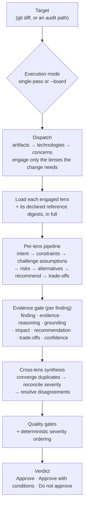
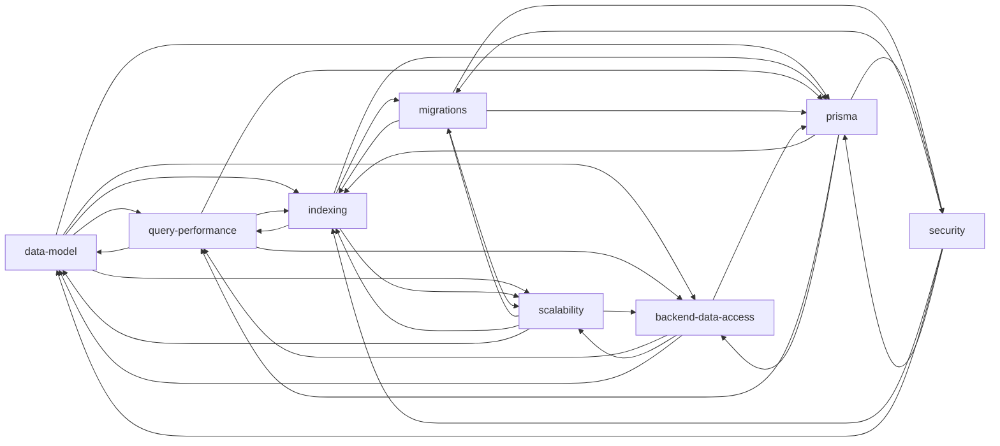

# How Argus works

This document explains Argus's flow and analytical approach: how a change goes in and a
grounded, evidence-first review with an approval decision comes out. For the binding rules
themselves, see [`skills/review/FRAMEWORK.md`](../skills/review/FRAMEWORK.md) (the contract)
and [`skills/review/SKILL.md`](../skills/review/SKILL.md) (the operational procedure).

## Two layers: reasoning vs facts

Argus deliberately separates *how to review* from *what is true*.

- **Lenses** (`skills/review/lenses/*.md`) hold **reasoning** — how each specialist thinks,
  what it challenges, the smells it knows, the trade-offs it weighs.
- **References** (`skills/review/references/*.md`) hold **facts** — distilled, source-keyed
  rules about PostgreSQL, Prisma, SQL, performance, modeling, migrations, security, and
  scale, each tied to the tiered [`bibliography.md`](../skills/review/references/bibliography.md).

The split lets the knowledge base track a new Prisma or PostgreSQL release by editing a
digest, without rewriting a single lens — and it is why a finding can name the exact rule and
source it rests on.

## The review pipeline

The stages that make the output senior-level rather than a linter:

- **Dispatch is first-class.** A migration file does not wake the query-performance lens; a
  repository method does not wake the migrations lens. The report says which lenses ran, which
  it skipped, and why. Effort is proportioned to the change.
- **The evidence gate is hard.** A finding ships only if it carries the full chain. "Consider
  adding an index" with no query behind it is dropped, not softened. Every Critical and High
  finding also names a **Grounding** source key, so a reader can tell an evidence-based claim
  from an assertion, and no blocker rests on the provenance tier alone.
- **Synthesis produces one voice.** Duplicate findings (the same defect seen by several
  lenses) converge into one, attributed to its corroborators. Conflicting severities take the
  maximum. Genuine disagreements are resolved into one recommendation with the condition that
  decides between them — the board reaches a position rather than handing you an argument.
- **The verdict is real.** Every review ends with the answer a staff engineer would put their
  name on: Approve, Approve with conditions, or Do not approve.

## The lens-interaction graph

Lenses are narrow on purpose and hand off to each other at their boundaries. Argus reconciles
the results; it does not emit eight separate opinions. An edge `A → B` means lens A hands a
concern to lens B (validated in CI by `check_cross_lens_handoffs`).

## Execution modes

- **Single-pass (default).** One reasoner holds the engaged lenses and runs the whole
  pipeline in one context. Fast and cheap; the right default for almost every review.
- **Board (`--board`).** Each engaged lens runs as an independent subagent that sees only its
  own lens and references, then the main context runs the synthesis protocol over their
  outputs. More faithful to true reviewer independence — no lens is anchored by another's
  conclusion — at the cost of latency and tokens. The convergence rule is what stops
  independent agents from triple-reporting the same defect.

## Validation

Argus is held to both halves of its job by golden projects under `validation/`:

- `golden-project-01` seeds real smells — a passing review must find them all and refuse to
  approve.
- `golden-project-02` is clean with false-positive traps — a passing review must flag none and
  approve.
- `golden-project-03` is correct-but-conditional — a passing review must approve *with named
  conditions*, exercising the third verdict branch.

Structure is checked deterministically in CI by [`scripts/validate.py`](../scripts/validate.py)
(manifests, the citation graph, the lens/domain maps, the cross-lens handoff graph, and the
eval↔fixture binding). The reviews themselves are graded against
[`skills/review/evals/evals.json`](../skills/review/evals/evals.json) with the skill-creator
plugin or the local [`scripts/run_evals.py`](../scripts/run_evals.py). See
[`docs/example-review.md`](example-review.md) for a full worked review.
